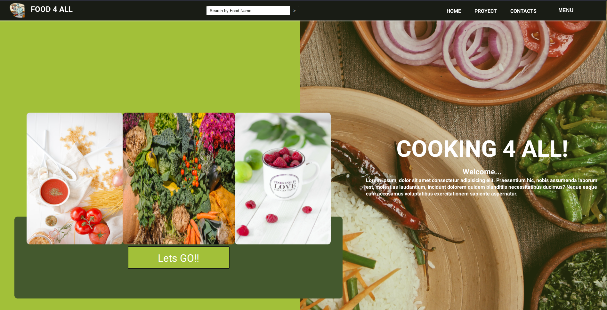
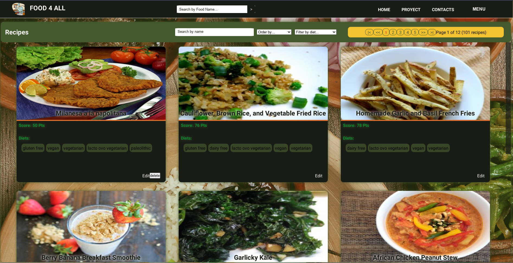
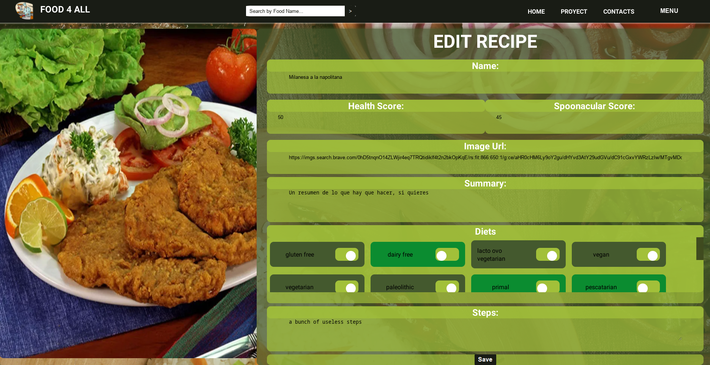
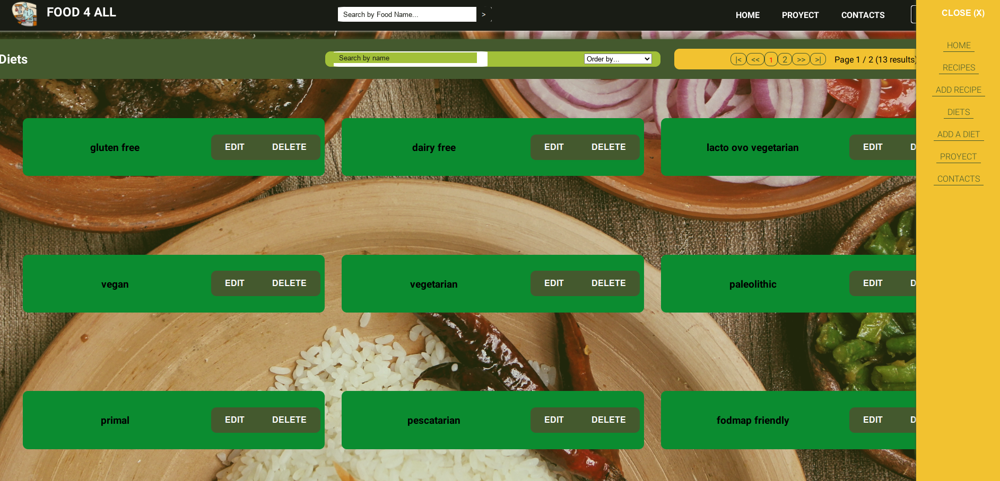

# Hubazar e-commerce

<p align="center">
  
</p>

## 📝Description:

This is a Project made for the Soy Henry bootcamp where we're supposed to be able to show the knowledge of the skills learned during the course. Basically its a front-end made in React.js and styled with styled-components, to show a fictional diets website.


#### Used technologies:
- [ ] HTML
- [ ] Javascript
- [ ] React
- [ ] Redux
- [ ] CSS modules
- [ ] NodeJS
- [ ] ExpressJS
- [ ] Sequelize - PostgreSQL

#### Running the App:

It has two folders: api and client. In these folders will be the back-end code and the front-end respectively. (In both urge NPM INSTALL).

To upload to your database In api you are going to have to create a file called: . env that has the following form:

```
PORT=5000
DB_HOST=localhost
DB_PORT=5432
DB_USER=userPostgres
DB_PASSWORD=passwordPostgres
DB_DATABASE=pf

```

Using PGAdmin you will create your new "development" database.
You need to replace `userPostgres` and `passwordPostgres` with your own credentials to connect to postgres. Also, you need a Mercadopago credentials to replace `tokenMercadopago` and `publicKeyMercadopago`. This file will be ignored by github as it contains sensitive information (credentials).

#### Features:

- [ ] Show the diets in a grid
- [ ] Edit the diets
- [ ] Add new diets
- [ ] Filter the diets by name, score and type
- [ ] show the Diet Types
- [ ] Edit the Diet Types
- [ ] Add new Diet Types

## Screenshots:
- Recipes:
<p align="center">
  
</p>

- Edit Recipe:
<p align="center">
  
</p>

- Diet Types:
<p align="center">
  
</p>
